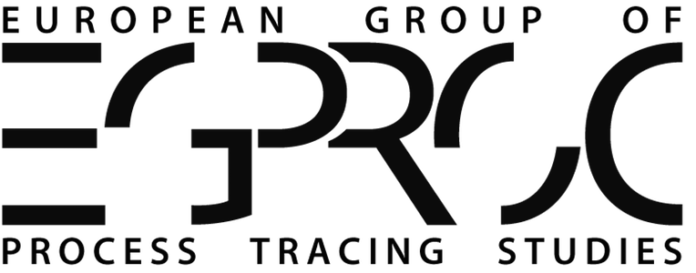

```{=html}
<h1></h1>
```

::: {.egproc-next}
## Next meeting
**EGPROC 2026** — Warwick, United Kingdom, 16–17 July 2026.
[Registration and details](news/egproc-2026.qmd)
:::

::: {.egproc-hero}

::: {.egproc-lead}
EGPROC is a group of researchers who share a common interest in process
tracing methods and theory. Every year the group meets to discuss new
developments, experiments or methods in the area of process tracing.
:::

::: {.egproc-actions}
[Past meetings](meetings/index.qmd){.btn .btn-primary role="button"}
[Join the mailing list](mailing-list/index.qmd){.btn .btn-outline-secondary role="button"}
:::

:::

## Latest news

::: {#latest-news}
:::

[All news →](news/index.qmd)

## Explore

:::::: {.egproc-cards}

::: {.egproc-card}
### [About EGPROC](about/index.qmd)
Who we are and what we do.
:::

::: {.egproc-card}
### [Meetings](meetings/index.qmd)
Every EGPROC meeting since 1982, with programs.
:::

::: {.egproc-card}
### [Mailing list](mailing-list/index.qmd)
Stay informed about EGPROC activities.
:::

::::::
